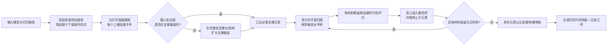
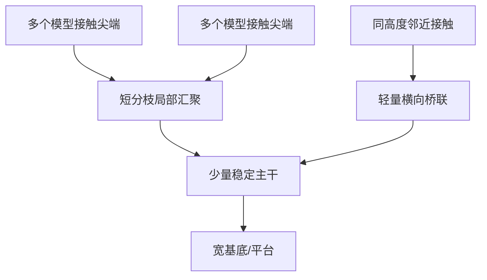

# 跨越间隙：面向 3D 打印的自动稳固桥式脚手架

> **论文**：Jérémie Dumas, Jean Hergel, Sylvain Lefebvre  
> *Bridging the Gap: Automated Steady Scaffoldings for 3D Printing*  
> **ACM Transactions on Graphics 33(4), SIGGRAPH 2014, Article 98**  
> DOI：[10.1145/2601097.2601153](https://doi.org/10.1145/2601097.2601153)  
> HAL：[hal-01100737](https://inria.hal.science/hal-01100737)  
> 本地原文：[2014_Ref20_Bridging-the-Gap_bridge-scaffolding.pdf](./2014_Ref20_Bridging-the-Gap_bridge-scaffolding.pdf)

---

## 1. 一句话理解这篇论文

论文把 FFF/FDM 本来被视为限制条件的“跨空桥接能力”反过来用作支撑结构的基本构件：

> **用少量竖直立柱承托水平桥梁，让一根桥梁汇集多个上方支撑点；同时在逐层打印的每个中间状态检查零件重心，自动增加稳定支撑。**

这不是传统的实体支撑体积，也不是依靠长斜杆逐级合并的树状支撑，而是一种类似建筑脚手架的 **桥梁—立柱网络**。



---

## 2. 论文解决的三个问题

### 2.1 悬垂不仅需要“托住”，打印中的零件还需要“不倒”

许多支撑算法只判断向下表面是否超过临界角度。但一个最终稳定的模型，在打印到一半时可能由多个尚未连合的孤立子件组成；某个子件的重心投影可能已经落在接地范围之外，因自重或喷嘴摩擦而倾倒。

因此论文同时处理：

1. **沉积可行性**：待挤出的丝材下面是否有足够承托；
2. **过程稳定性**：每一层、每个连通子件是否保持静态平衡并留有抗扰动余量；
3. **支撑可制造性**：每根水平桥的两端在打印它之前必须已有承托。

### 2.2 树状支撑省料，但细长斜杆可能不可靠

树状结构能把多个支撑点逐级汇入少数根柱，理论上很省料，但论文指出两类实际风险：

- 斜柱层间粘结面积较小，冷却翘曲不均，对温度、材料和层高更敏感；
- 上部重量及喷嘴摩擦会在少数底柱上产生弯矩，造成弯曲、摇摆甚至倾覆。

桥式结构以两端立柱约束水平梁，形成更稳定的受力路径；主体立柱保持竖直，也更容易可靠打印。

### 2.3 致密体积支撑可靠，但材料和时间成本高

传统方法将悬垂面向下拉伸成支撑体积，再填入稀疏网格。这类结构接地与接触面积大、成功率高，却会填满模型下方大量空间。论文目标是在稀疏支撑的材料水平上，尽量获得体积支撑的稳定性和自动化程度。

---

## 3. 核心结构：桥梁、立柱和顶部短斜连接

| 构件 | 几何与作用 | 可打印约束 |
|---|---|---|
| 竖直立柱 | 从平台、模型表面或下层桥梁向上生长 | 比长斜柱更稳定；论文最终采用十字形截面 |
| 水平桥梁 | 横跨空隙，把多个上方支撑元素汇集到两端 | 两个端部必须由立柱、其他桥或模型承托 |
| 顶部短斜杆 | 补偿支撑点与下方桥之间的小水平偏差 | 偏移/高度比受限；实现中最大水平偏移 5 mm |
| 侧向接驳 | 桥端直接连接模型侧壁 | 模型上增加一层厚的微小凸缘，便于桥接和拆除 |

论文实物中的桥梁只有：

- 横向 **两条挤出线**；
- 竖向 **两层厚**；
- 两线之间约 **0.4 mm** 间距；
- 典型总截面量级约为 $0.8\text{ mm}\times0.4\text{ mm}$。

一个仅约 **0.5 g** 的演示脚手架可以承受 **83 g** 咖啡杯。作者因此在算法中主要优化拓扑和材料长度，没有进行完整有限元强度优化。

---

## 4. 桥式支撑与树状支撑的理论比较

作者考虑同一水平面上均匀分布的 $2^k\times2^k$ 个点，点间距为 1 mm，并令树枝以 $45^\circ$ 倾斜逐层汇合。

树状结构汇总所有点所需的总杆长为：

$$
L_t(k)=2^k\left(2^{k+1}-2\right)
$$

其汇聚部分的高度为：

$$
h_t=\frac{2^k-1}{\sqrt{2}}
$$

在相同高度支持同一组点，桥式结构所需总杆长为：

$$
L_b(k)=2(2^k-1)\left(1+\sqrt{2}+2^{k-1}\right)
$$

论文指出，当 $k\ge 3$ 时，初始汇聚阶段桥式结构反而比树更节省杆长。继续增加支撑高度后：

- 树只延长一根合并后的主柱；
- 桥式结构需要延长四根稳定立柱。

两者达到相同材料长度的附加高度 $h$ 满足：

$$
L_t(k)+h=L_b(k)+4h
$$

例如支持 $16\times16$ 个间隔 1 mm 的点时，树状方案要到额外高度约 **56 mm** 后才重新体现材料优势；但此时细长树干和斜枝已明显容易受喷嘴作用而失稳。作者的结论不是“桥永远比树省料”，而是：

> **在实际常见高度内，桥式网络的材料量可以与树状结构接近，同时用多根竖柱换取显著更好的稳定性。**

---

## 5. 第一阶段：确定必须支撑的挤出路径点

### 5.1 从切片后的真实打印路径出发

算法不是只分析 STL 面法向，而是先在没有支撑的情况下切片，取得完整打印路径：

- 外轮廓路径（perimeter）；
- 内部填充路径（infill）。

这样判断对象直接对应“下一段塑料丝能否被下层承托”，并能自然考虑稀疏填充，而不是把整个模型内部误当作实心。

### 5.2 喷嘴尺度的圆盘覆盖测试

对每个路径线段端点 $u$，在其位置放置一个直径等于喷嘴直径的圆盘。论文设置：

- 喷嘴直径：**0.4 mm**；
- 层图像分辨率：**0.05 mm/像素**；
- 若圆盘超过 **50%** 的面积不被下一层模型覆盖，则端点无支撑。

形式化写作：

$$
\operatorname{unsupported}(u)
\iff
\frac{\operatorname{Area}(D_u\setminus\Omega_{z-\Delta z})}
{\operatorname{Area}(D_u)}>0.5
$$

其中 $D_u$ 是以 $u$ 为中心的喷嘴尺度圆盘，$\Omega_{z-\Delta z}$ 是下一层已有材料区域。

只检测线段端点的依据是：若端点得到承托，中间线段本身可以作为短桥。但为控制底面质量，任何超过 **5 mm** 的路径段都会先被重新采样。

### 5.3 用丝材自身刚度稀疏化支撑点

检测出的所有无支撑端点并不都要变成支撑接触点。冷却中的塑料丝具有一定刚度，一个支撑点也能承托附近一段路径。作者以取消距离 $\tau=2$ mm 去重。

对外轮廓，使用同一条曲线上的弧长距离：

$$
C(u,v)<\tau
$$

则新点 $u$ 可由已有点 $v$ 的邻域覆盖，不再加入。

对非外轮廓路径，以同层或近似同高的欧氏距离判断：

$$
z(v)\approx z(u),\qquad \|u-v\|<\tau
$$

最终得到打印丝材层面的必需支撑点集 $S$。

### 5.4 支撑点选择伪代码

```text
S = ∅

for 每条外轮廓路径 perimeter:
    for 路径端点 u:
        if u 的喷嘴圆盘缺少下层覆盖:
            if 同一路径中不存在弧长距离 < τ 的已有支撑点:
                S 加入 u

for 每条非外轮廓路径 path:
    for 路径端点 u:
        if u 的喷嘴圆盘缺少下层覆盖:
            if 同高度不存在欧氏距离 < τ 的已有支撑点:
                S 加入 u

return S
```

---

## 6. 第二阶段：保证整个打印过程不倾倒

这是论文区别于普通悬垂检测的关键贡献。

### 6.1 逐层、逐三维连通子件分析

模型最终可能是一个整体，但低层阶段可能分裂成多个独立子件。算法从底向上扫描每一层，并为当前的每个三维连通子件分别维护：

- 已打印材料的质量与质心；
- 当前支撑基底 BoS（Base of Support）；
- 已发现的悬垂支撑点；
- 可用来扩大 BoS 的底表面候选点。

每层打印路径被栅格化为 0.05 mm/像素的图像，并以连通分量 ID 着色。只需保留当前层和下一层图像，即可更新三维连通关系。

### 6.2 按真实丝材分布计算质心

对均匀密度材料，连通子件 $\Omega$ 的质心为：

$$
\mathbf c=\frac{\int_\Omega \rho\mathbf x\,d\mathbf x}
{\int_\Omega \rho\,d\mathbf x}
$$

实现时，每个已打印路径像素代表同样的小体积和单位质量，累加其坐标即可。这里采用真实打印路径而不是封闭网格体积，因而能计入稀疏填充造成的质量分布变化。

### 6.3 支撑基底 BoS

支撑基底定义为当前连通子件所有有效承重点在 $XY$ 平面的凸包：

$$
\mathrm{BoS}=\operatorname{ConvHull}(Q)
$$

初始层中与打印平台直接接触的所有像素加入 $Q$；随后，归属该连通子件的支撑点投影也加入 $Q$。

桥式结构有一个重要性质：桥的两端最终一定由竖柱承托，因此所有支撑点的投影都会包含在整套脚手架的接地凸包中。由此，算法能在尚未完成脚手架几何时先分析稳定性。

### 6.4 从静态平衡到抗扰动稳定

刚体在水平面上的基本静态平衡条件是质心的竖直投影落入 BoS：

$$
\pi_{XY}(\mathbf c)\in\mathrm{BoS}
$$

仅仅“刚好落入”不足以抵抗喷嘴摩擦。论文在质心投影周围建立半径 $r=3$ mm 的安全圆盘，并要求整个圆盘都在 BoS 内：

$$
D\!\left(\pi_{XY}(\mathbf c),r\right)\subseteq\mathrm{BoS}
$$

论文作出两项保守简化：

- 不计模型与平台之间的粘附力；实际粘附只会提高稳定性；
- 把已打印子件视作刚体，没有求解弹性变形。

### 6.5 BoS 不足时如何自动补点

算法持续收集位于零件底表面、但其投影还不在当前 BoS 内的候选点。若质心安全圆越出 BoS：

1. 给每个候选点也关联一个半径为 $r$ 的圆；
2. 试算把它加入后新凸包对质心安全圆的覆盖增量；
3. 贪心选择覆盖增量最大的候选点；
4. 重复，直到质心安全圆完全被覆盖；
5. 删除最终凸包中已不再起作用的早期冗余点；
6. 将保留点标记为必需支撑点。

若选中的几何候选点并不直接接触零件表面，则在它与真实表面点之间加入一段短水平桥，并把这段桥作为后续脚手架生成器的必需输入。

这一机制还能自动形成局部“筏板”：当零件第一层接触面过小时，稳定点会向外扩展 BoS，而无需用户手动开启 raft。

---

## 7. 第三阶段：把支撑点组织成可打印桥式脚手架

### 7.1 输出必须满足的硬约束

生成结构必须满足：

1. 只由竖直立柱、水平桥和局部短斜连接组成；
2. 所有必需点都被立柱或连接杆承托；
3. 每根立柱向下连接平台、模型或已有桥；
4. 每根水平桥的两端连接立柱、其他桥或模型；
5. 构件不得与模型或已经生成的脚手架非法碰撞。

第 4 条把制造顺序直接编码进拓扑：如果桥端没有下方承托，这根桥本身就无法打印。

作者曾尝试在规则网格上建立整数优化，但除最简单模型外计算无法在实用时间内结束，因此改为贪心算法。

### 7.2 桥梁收益函数

设候选桥 $b$：

- 长度为 $w_b$；
- 高度为 $h_b$；
- 汇集上方 $k$ 个元素。

若不用桥，近似需要 $k$ 根从地面升到 $h_b$ 的柱；加入桥后，只需两端柱和一根水平梁，因此材料长度收益近似为：

$$
\operatorname{Gain}(b)=(k-2)h_b-w_b
$$

只有满足：

$$
\operatorname{Gain}(b)>0
$$

的桥才会加入。由公式可见，桥至少要聚合三个元素才可能产生正收益。

若桥的端部竖柱会先碰到模型，而不必一直落到平台，则改用两端实际自由柱长 $h_1,h_2$：

$$
\operatorname{Gain}(b)=k h_b-h_1-h_2-w_b
$$

若桥端直接接入模型，则相应的 $h_1$ 或 $h_2$ 为 0。

### 7.3 评分函数：不仅要省，还要连接均匀

候选桥评分为：

$$
\operatorname{Score}(b)=\operatorname{Gain}(b)-k\,l_{\max}(b)
$$

$l_{\max}(b)$ 是上方元素到新桥的最长连接长度，包括因不完全对齐产生的非竖直部分。惩罚项避免选出一根材料账面上有收益、但某些上方连接过长或分布极不均匀的桥。

算法以 Gain 是否为正作为可接受门槛，再以 Score 比较候选优劣；最优 Score 本身可能仍为负。

### 7.4 候选桥的最优高度离散化

参数 $l_{\min}=1.6$ mm 规定新桥与其上方受支撑元素之间的最小竖向间距。桥越低，柱长节省越少，Gain 不会增加。因此，对一组元素而言，材料收益最大的桥必定尽量靠近其中最低元素，即位于其下方 $l_{\min}$ 附近。

于是无需连续搜索所有高度，只需测试由各锚定元素导出的有限个临界高度。

---

## 8. 锚定线段：把“可以接在哪里”编码成几何区间

### 8.1 桥梁的锚定线段

一根尚未确定最终长度的桥，在左右端各有一段锚定线段，表示下方立柱可以接入的端点区间。区间长度同时执行最大桥长约束；论文实现中的最长桥为 **30 mm**。

当新桥或立柱接入一个端部时，执行 **snap（吸附）**：

- 桥的实体段延伸到实际接入位置；
- 对应锚定段关闭；
- 另一端剩余锚定段按最大桥长更新。

两端都未闭合的称为 open bridge，一端已闭合的称为 half-open bridge。桥的最终长度直到两端都吸附后才完全确定。

### 8.2 点的锚定线段

完全竖直连接要求上下元素在平面上精确对齐，实际很少发生。作者允许竖柱顶部接一小段斜杆，因此每个点在当前扫描方向上对应一段可接受的锚定区间。

该区间由短斜杆的最大水平偏移决定，实现中为 **5 mm**；同时受斜杆水平偏移与竖向高度比例限制。不同扫描方向需要重新生成点锚定段。

一根桥的实体段端点也被当作待支撑“点”。一旦相应桥端完成 snap，其锚定段便被移除。

---

## 9. 多方向平面扫描与贪心构造

### 9.1 为什么需要多方向

如果只允许 X/Y 轴方向的桥，斜向分布的支撑点会被拆成更多组，产生额外立柱。论文用 $d=8$ 个扫描方向，因方向对称性，角度步长为：

$$
\Delta\theta=\frac{\pi}{8}
$$

从而降低方向偏置。

### 9.2 单一方向的扫描逻辑

假定当前扫描方向旋转到 X 轴：

1. 建立所有待支撑点和开放桥端的锚定线段；
2. 用 YZ 平面沿 X 轴扫描；
3. 锚定线段的端点，以及它们在 XY 投影中的交点，构成事件；
4. 到达事件时更新与扫描面相交的活动锚定段集合；
5. 在扫描面内沿 Y 方向枚举桥的两端组合；
6. 对每个由锚点产生的候选高度，计算可承托元素、碰撞、Gain 和 Score；
7. 保存这一轮所有方向中 Score 最好的正收益桥。

### 9.3 完整构造伪代码

```text
E = 必需支撑点 R ∪ 稳定性分析产生的必需桥 B

while true:
    bestBridge = ∅

    for 每个扫描方向 i:
        S = 为 E 创建该方向的锚定线段
        Q = 按 X 排序的端点与投影交点事件
        P = 当前穿过扫描面的活动线段集合

        while Q 非空:
            e = 最左事件
            将从 e 开始的线段加入 P
            candidate = 在 P 中枚举并选择最优桥
            若 candidate 的评分更优:
                bestBridge = candidate
            将在 e 结束的线段移出 P

    if bestBridge 为空或不存在 Gain > 0 的候选:
        break

    将 bestBridge 支撑的所有上方元素吸附到它：
        建立竖柱
        必要时在柱顶加入短斜连接
    将 bestBridge 加入活动元素 E

将仍未汇集的开放元素用立柱连接到平台或模型
```

### 9.4 单个扫描面中的候选枚举

对扫描面与活动锚定段的交点，按 Y 排序为 $C$；所有交点导出的合法桥高组成集合 $Z$。随后：

```text
for z in Z:
    for 左端索引 i1:
        A = ∅
        for 右端索引 i2 从 i1 向右扩展:
            若桥长超过上限则停止
            把 C[i2] 能承托的元素加入 A
            若桥、顶部连接或已有结构发生碰撞则停止
            计算 Gain 和 Score
            若 Gain > 0 且 Score 更优，保存候选
```

若同一个上方元素可通过多个锚定段接入当前桥，只保留连接长度最短的方案。

### 9.5 碰撞与连接模型

每个候选都要检查：

- 水平桥与模型是否相交；
- 从桥到上方元素的竖直/短斜连接是否相交；
- 是否与已放置桥梁冲突。

另外，候选桥可沿自身方向延伸到模型表面，在最大桥长允许时用模型侧壁取代端部立柱；评分时该端柱长记为 0。

---

## 10. 计算复杂度与运行时间

论文给出的总时间复杂度上界为：

$$
O\!\left(d\,(n+k)n^3cb\right)
$$

其中：

- $d$：扫描方向数；
- $n$：待支撑元素数；
- $k$：锚定线段在 XY 投影中的交点数；
- $c$：一次碰撞测试的最大复杂度；
- $b$：主循环中新加入的桥数。

这是偏保守的上界。实际加速因素包括：

- 不同方向可以并行；
- 一个扫描面通常只穿过全部锚定段中的一小部分；
- 新桥一旦吸收多个点，这些点会从后续问题中移除。

实验平台：Intel i7-4770K 3.50 GHz、8 线程、32 GB RAM、GeForce GTX Titan，$d=8$。

| 模型 | 尺寸 | 最大元素数 | 桥构造迭代数 | 桥构造 | 重心/稳定分析 |
|---|---:|---:|---:|---:|---:|
| Knot | 45.9 mm | 155 | 4 | 263 ms | 3.9 s |
| Servojoint | 65.6 mm | 195 | 21 | 676 ms | 7.3 s |
| Gymnast | 98.8 mm | 114 | 17 | 712 ms | 19.3 s |
| Bunny 5 cm | 55.0 mm | 302 | 42 | 18 s | 2.6 s |
| Hilbert | 30.0 mm | 262 | 26 | 3 s | 1.2 s |
| Minotaur | 99.5 mm | 391 | 49 | 43.2 s | 13.9 s |
| Enterprise | 152.8 mm | 823 | 75 | 1 min 12 s | 24.2 s |
| DNA | 94.8 mm | 867 | 104 | 4 min 17 s | 16.7 s |

大多数实例在当时硬件上低于 5 分钟。

---

## 11. 最终几何和切片处理

### 11.1 几何构成

最终结构由盒体和圆柱等基本体并集构成：

- 立柱采用作者实验认为比圆柱更可靠的 **十字形截面**；
- 桥由两条平行、单线宽的线段构成，并打印两层；
- 作者的切片器能直接处理相互穿插的网格并集。

### 11.2 接触区减薄以便拆除

每一切片中，支撑与模型接触处对支撑结构腐蚀 **0.2 mm**，降低界面连接强度。侧向桥接到模型时，在模型侧增加一层厚的小凸缘作为接驳台；这个微小塑料环在后处理时容易折断。

### 11.3 桥接工艺参数与可靠性

主要实物使用 MakerBot Replicator 1、ABS：

- ABS 挤出温度：图 3 测试为 **220°C**；
- 桥打印速度：**60 mm/s**；
- 打桥前额外挤出：**0.1 mm 丝材**；
- 桥长可靠性测试：**30 mm**；
- 层高：主要结果 **0.2 mm**。

30 mm 桥沿 X、Y 和 $45^\circ$ 方向成批测试：

- 所有桥最终都形成了平整顶面；
- 首层桥丝平均下垂约 **0.8 mm**；
- 约 **12%** 的首根丝未能接到对端而悬垂；
- 但后续桥丝仍能覆盖并形成可承托的上表面。

两根 30 mm 桥承托 Minotaur 模型时，挠度低于 **0.3 mm**。相同桥参数也在 Ultimaker 2 + PLA 上测试成功。

---

## 12. 实验结果与公平解读

### 12.1 统一测试条件

除专门对比表外，全部模型使用相同设置：

- MakerBot Replicator 1 Dual；
- ABS；
- 外轮廓 40 mm/s；
- 其他路径和支撑 60 mm/s；
- 空移 120 mm/s；
- 层高 0.2 mm。

比较均在软件自动模式下进行，不对生成支撑做人工修补。

### 12.2 与 MeshMixer、MakerWare、Photoshop CC 比较

Enterprise：

- MeshMixer 总丝材 9.7 m；
- 本文 9.89 m，材料接近，但支撑分布更均匀；
- MakerWare 约 18.8–19 m，因为填充了模型下方较大体积；
- Photoshop CC 支撑材料 4.61 m、总材料 11.97 m；
- 本文支撑材料 2.31 m、总材料 9.48 m（按 Photoshop 配置的该组比较）。

Minotaur：

- MeshMixer 6.7 m，较省，但一根主柱通过长斜杆承受两臂，实际打印失败/极不稳定；
- 本文 7.66 m，耗材较多，但结构稳固并成功打印；
- MakerWare 约 10.1–10.8 m。

这组结果揭示论文真正优化的是：

> **在材料量与树状支撑相近的前提下提高无人干预打印的稳定性，而不是在所有模型上取得绝对最低耗材。**

### 12.3 表 2：总打印时间与总丝材长度

| 模型 | MakerWare | MeshMixer | 本文方法 |
|---|---:|---:|---:|
| Servojoint | 1h15 / 4.64 m | 1h05 / 3.44 m | 1h14 / 3.86 m |
| Knot | 1h12 / 4.17 m | 1h08 / 3.85 m | 1h20 / 4.01 m |
| Enterprise | 3h33 / 19 m | 3h38 / 9.7 m | 3h14 / 9.89 m |
| Minotaur | 2h28 / 10.1 m | 2h04 / 6.7 m | 2h37 / 7.66 m |

> **重要口径**：表中的 m 是模型与支撑合计的丝材长度，不是纯支撑耗材；不能直接把两个总长度的差额解释为“支撑材料降低百分比”。

Servojoint 中，MakerWare 和 MeshMixer主动不支撑可桥接悬垂；本文选择更多支撑点，底面更粗糙，但层间结合更好，其结构仍约为 MakerWare 支撑规模的三分之一。Knot 是本文不占优势的案例：其他软件只用少量细杆，本文会建立完整桥梁；而且 MakerWare、MeshMixer 版本仍需要用户额外加 raft 才能稳定。

### 12.4 其他实例

- DNA：打印 3h36，总丝材 8.7 m；
- 5 cm Bunny Peel：本文 1.97 g，而人工优化过的 MeshMixer 版本仅 0.75 g；
- Poppy 机器人上腿：Ultimaker 2 + PLA、0.3 mm 层高成功打印；
- Hilbert cube：桥梁可用空间很少，算法仍生成并打印成功；
- Gymnast：自动生成多级桥式脚手架，并包含半空中对右脚的承托。

---

## 13. 支撑拆除与表面质量

- 大多数结构可用手施加轻力拆除；
- 复杂交错桥梁偶尔需要小剪钳；
- 接触处会留下浅白痕，可用加热或丙酮蒸汽处理；论文展示件没有做这些美化；
- 桥底面的首丝会下垂，但桥顶面平整，因此能继续承托上层；
- 作者认为可用可溶材料打印这种结构，但未给出双材料实验。

Enterprise 的细发动机连接件小于 1.5 mm，在拆支撑时断裂并需粘回。这是模型本体强度不足，而非支撑未能托住模型，也暴露出算法没有联合评估“拆支撑时零件是否会损坏”。

---

## 14. 论文的主要贡献

### 贡献 1：过程级稳定性，而非最终姿态稳定性

逐层跟踪尚未连接的三维子件，用真实填充路径计算质心，以“质心安全圆包含于 BoS”为条件自动补点。这比只看最终模型的重心更符合打印失效机制。

### 贡献 2：把 FFF 桥接能力变成支撑聚合机制

一根桥以两个端柱换取对多个上方点的汇集，达到树状分流/合流的材料效率，同时减少长斜柱带来的弯矩和打印不确定性。

### 贡献 3：可制造性内生于搜索过程

开放桥端、锚定线段和 snap 操作保证每根桥的两端最终都有先验承托；不像一般拓扑优化那样，优化后还可能得到无法按层制造的水平杆。

### 贡献 4：统一的自动参数用于多类模型

测试中未按模型手工编辑支撑，稳定性补点、桥分组和碰撞规避均由算法完成。

---

## 15. 局限与没有解决的问题

### 15.1 没有真实力学优化

作者凭桥梁实测强度，主要按杆长和拓扑优化，没有计算：

- 桥的应力、屈曲与疲劳；
- 立柱在喷嘴冲击下的动态响应；
- 层间各向异性与温度引起的非线性变形；
- 模型和支撑共同变形。

3 mm 重心安全半径是经验常数，没有依据质量、高度、扰动力或摩擦系数自适应。

### 15.2 几何感知主要停留在碰撞检测

扫描算法不会主动分析模型孔洞、通道或形状语义来引导桥梁穿越，可能错过穿过孔洞的优质候选。模型只在碰撞测试与桥端接驳中参与决策。

### 15.3 贪心法不保证全局最优

每轮加入当前评分最好的桥，早期决定可能限制后续组合；Gain 还把所有构件材料代价近似为长度，没有精确计入十字柱、桥、斜连接截面积的差异。

### 15.4 打印时间未充分优化

大量短小顶端连接导致启停与移动开销，因此虽然材料常显著少于 MakerWare，打印时间未总是同步下降。作者建议把同一桥上的多个连接合并成连续构件。

### 15.5 支撑拆除与模型脆弱性未联合考虑

算法只确保打印过程中获得承托和稳定，没有预测拆除载荷，也不会自动加强模型薄弱部位。

### 15.6 首桥丝失败仍然存在

30 mm 桥测试中约 12% 的首丝未连接成功。虽然不妨碍顶面形成，但会产生悬挂废丝，复杂模型中可能干扰喷头或清理。

---

## 16. 对光固化 SLA/DLP/LCD 的迁移价值

> 本节是基于论文结构思想的工程推演，**不是原文已经验证的结果**。论文实验全部基于 FFF/FDM；作者只在结论中说该结构“可能有益于立体光固化”，并明确指出约束不同。

### 16.1 可以直接借鉴的抽象思想

1. **支撑点与支撑拓扑分层**：先求必须支撑的位置，再组织成共享主干/横梁网络；
2. **过程状态分析**：逐层分析当前已固化岛区，而不是只检查最终几何；
3. **多个接触点共享构件**：以桥梁或横向连杆汇集多个上方支撑，减少重复长支柱；
4. **硬性可制造约束参与搜索**：候选构件在加入时就验证方向、碰撞和前序承托；
5. **稳定性安全裕量**：将临界平衡扩展为带安全半径的约束。

### 16.2 不能直接照搬的物理假设

底置光固化中，主导载荷通常不是喷嘴摩擦和重力倾覆，而是：

- 固化层从离型膜剥离时的法向拉力；
- 平台升降和树脂流动引起的阻力；
- 大截面固化的吸盘效应；
- 细长支撑在周期拉伸下的弯曲或疲劳；
- 接触尖端脱落、模型翘曲和支撑压痕。

因此，原论文的质心—BoS 条件最多只能作为辅助约束，不能代替剥离载荷分析。

### 16.3 光固化版目标函数建议

可将原来的杆长收益扩展为多目标代价：

$$
J=
\alpha V_{support}
+\beta F_{peel,max}
+\gamma C_{compliance}
+\delta N_{contact}
+\varepsilon A_{scar}
+\zeta T_{drain}
$$

分别约束/惩罚：支撑树脂体积、最大剥离力、结构柔度、接触点数量、表面疤痕和树脂排液困难。

桥梁 Gain 也不能只按长度计算，应按截面积和体积重写：

$$
\operatorname{Gain}_{V}(b)
=V_{removed\ pillars}-V_{bridge}-V_{end\ pillars}-V_{joints}
$$

并增加力学可行性：

$$
\sigma_{tip}\le\sigma_{allow},\qquad
\delta_{max}\le\delta_{allow},\qquad
F_{peel}\le F_{support}
$$

### 16.4 光固化“桥式支撑”应怎样重新定义

FFF 的桥必须在空中横向挤出，因此两端先有立柱是制造约束；光固化每层由曝光面整体固化，横梁只需在当前切层与已有固化区域保持连接，但过长水平梁仍可能因：

- 首层横截面太薄；
- 离型拉伸使梁弯曲；
- 液态树脂阻尼和流动；
- 横梁形成封闭腔或积液区；

而失败。迁移时应把“最大桥长 30 mm”和 FFF 的短斜杆参数全部重新标定，不能沿用论文数值。

### 16.5 面向高树脂利用率的启发

桥式网络适合连接空间上接近但高度相似的多个接触点；树状结构适合跨较大高度逐级合并。更有潜力的光固化方案可能是二者混合：



即用短树枝完成局部接触与避障，用轻量桥联消除重复主干，并根据剥离载荷保留足够多的纵向承力路径。

---

## 17. 复现所需参数表

| 模块 | 参数 | 论文取值 |
|---|---|---:|
| 路径承托检测 | 喷嘴直径 | 0.4 mm |
| 路径承托检测 | 层图像分辨率 | 0.05 mm/像素 |
| 路径承托检测 | 无承托圆盘面积阈值 | 50% |
| 路径重采样 | 最长路径段 | 5 mm |
| 支撑点稀疏化 | 取消距离 $\tau$ | 2 mm |
| 稳定分析 | 质心安全圆半径 $r$ | 3 mm |
| 桥构造 | 上方元素最小间距 $l_{\min}$ | 1.6 mm |
| 桥构造 | 最大桥长 | 30 mm |
| 顶部斜连接 | 最大水平偏移 | 5 mm |
| 方向搜索 | 扫描方向数 $d$ | 8 |
| 方向搜索 | 角度步长 | $\pi/8$ |
| 接触可拆性 | 接触处腐蚀量 | 0.2 mm |
| 桥打印 | 桥宽/厚 | 2 条线 × 2 层 |
| 桥打印 | 两条线间距 | 0.4 mm |
| 桥打印 | 打桥前预挤出 | 0.1 mm 丝材 |
| 桥打印 | 支撑打印速度 | 60 mm/s |

这些数值是作者在 Replicator 1/Ultimaker 2、ABS/PLA、约 0.4 mm 喷嘴条件下的经验设置，不应无标定迁移到其他设备或光固化工艺。

---

## 18. 完整复现路线

```text
输入：三角网格 M、打印参数、构建方向 Z

1. 对 M 无支撑切片，得到按 Z 排序的 perimeter 与 infill 路径。
2. 将每层路径栅格化为 0.05 mm/像素图像。
3. 对路径端点执行喷嘴圆盘覆盖测试；长于 5 mm 的段先重采样。
4. 按 τ=2 mm 对无支撑点稀疏化，得到沉积所需支撑点。
5. 自底向上更新三维连通子件：
   a. 累加路径像素，更新各子件质心；
   b. 更新各子件 BoS；
   c. 检查半径 3 mm 的质心安全圆是否在 BoS 内；
   d. 若不在，贪心加入最大覆盖增量候选点；
   e. 必要时增加连接候选点与模型表面的短桥。
6. 汇总必需点 R 和必需桥 B，建立活动元素集合 E。
7. 对 8 个方向生成点/桥锚定段，进行事件平面扫描。
8. 在每个事件处枚举端点组合与临界高度：
   a. 最大桥长 30 mm；
   b. 计算上方可吸附元素；
   c. 检查模型、连接杆、已有桥碰撞；
   d. 计算 Gain 与 Score。
9. 贪心加入全方向最优且 Gain>0 的桥，snap 上方元素。
10. 重复步骤 7–9，直到没有正收益候选。
11. 将剩余开放端以竖柱连接至平台、下层桥或模型。
12. 将拓扑转成十字柱、双线双层桥、短斜连接和侧接驳几何。
13. 接触处按 0.2 mm 腐蚀，切片并输出打印路径。
```

### 原文未完全公开、复现时仍需自行决定的细节

- 十字形立柱的精确臂宽和截面尺寸；
- 斜连接“偏移/高度比”的具体阈值；
- 像素层之间判断三维连通的邻域规则；
- 候选底表面点的采样密度及相同收益的平局规则；
- 碰撞检测容差及桥—桥允许接触的判据；
- Gain/Score 在不同截面构件之间的标定；
- 最终无正收益元素如何选择落地、接桥或接模型的完整细节；
- 整数规划失败方案只在补充材料中描述，正文不足以完整重建。

---

## 19. 关键图表导读

| 原文位置 | 内容 | 展示时建议强调 |
|---|---|---|
| Figure 1 | Poppy 机器人腿、桥式脚手架、清理后零件 | 结构形态与最终效果 |
| Figure 2 | 同材料桥式/树状高架实物对比 | 树因细长主干和喷嘴摩擦失稳 |
| Figure 3 | 30 mm 多方向桥批量测试 | 首丝下垂不等于顶面失败 |
| Figure 4 | 悬空方盒的支撑点、脚手架、底面 | 路径承托点如何转成结构 |
| Figures 5–6 | 中间层四个子件、CoM 圆、BoS、多余稳定桥 | 论文最关键的过程稳定性思想 |
| Figure 7 | 桥/点锚定段和扫描事件 | 扫描算法的几何表达 |
| Figure 8 | 柱、侧接、竖向连接和半空承托 | 最终构件细节 |
| Figures 10–12 | MeshMixer、Photoshop 与本文比较 | 材料效率与可靠性的权衡 |
| Table 1 | 运行时间 | 算法规模与可用性 |
| Table 2 | 时间和总丝材长度 | 注意不是纯支撑耗材 |
| Figure 17 | Minotaur 成功/失败实物对照 | 稍多材料换取无人修补的可靠性 |

---

## 20. 汇报用总结

### 原理

用水平桥把多个支撑点汇集到少量竖柱上，避免体积支撑填满空间，也避免树状支撑把载荷集中到长斜杆和单根主柱。

### 技术关键

1. 在切片路径上用喷嘴圆盘覆盖测试寻找真正缺少下层承托的挤出点；
2. 逐层跟踪每个连通子件，以质心安全圆是否完全落入 BoS 判断过程稳定性；
3. 用锚定线段描述点和开放桥端的合法接入区间；
4. 以材料长度 Gain 和连接均匀性 Score，在多个方向上扫描并贪心选择桥梁；
5. 通过“两端必须先有承托”的拓扑约束保证生成结构可打印。

### 实验结论

桥式脚手架通常比 MakerWare 的致密支撑明显省料，与 MeshMixer 树状结构材料相近；在 Minotaur 等重悬臂模型上，它虽然不是最省材料，却因多柱和桥梁约束而成功打印，体现了论文强调的 **可靠性—材料量折中**。

### 对光固化的价值

最值得迁移的不是 30 mm 桥长等 FFF 参数，而是“支撑点—过程稳定性—共享构件—可制造拓扑”的分层框架。若用于 SLA/DLP/LCD，必须把喷嘴扰动和重心判据改造成以剥离力、结构柔度、接触强度、排液与吸盘效应为核心的物理模型。

