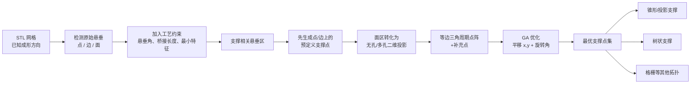

# 增材制造支撑点确定与支撑体积降低

> **论文**：Zhiping Wang, Yicha Zhang, Shujie Tan, Liping Ding, Alain Bernard,  
> *Support Point Determination for Support Structure Design in Additive Manufacturing*,  
> **Additive Manufacturing 47 (2021), 102341**  
> DOI: [10.1016/j.addma.2021.102341](https://doi.org/10.1016/j.addma.2021.102341)  
> 本地原文：[2021_Support-point-determination_support-volume-reduction.pdf](./2021_Support-point-determination_support-volume-reduction.pdf)

---

## 1. 一句话理解这篇论文

这篇论文不是直接设计“树状、格栅或锥形支撑的形状”，而是先解决一个更底层的问题：

> **零件上究竟哪些地方必须被支撑，需要多少个支撑接触点，这些点应放在哪里？**

作者将问题拆成两层：

1. 用 STL 网格几何和工艺约束，从“原始悬垂区”中剔除实际可以自支撑的部分，得到真正需要支撑的 **support-relevant overhangs**（支撑相关悬垂区）。
2. 在这些区域上铺设等边三角形周期点阵，再用遗传算法优化点阵的平移和旋转，以减少支撑点数量及总支撑长度。

得到的支撑点集与下游支撑形状解耦，既可生成普通垂直/锥形支撑，也可以生成树状支撑。



---

## 2. 论文要解决的核心矛盾

### 2.1 支撑过少和过多都不行

| 状态 | 直接后果 |
|---|---|
| 支撑点太少或位置不合理 | 悬垂区下垂、局部崩塌、铺粉时被刮掉、尺寸偏差过大 |
| 支撑点太多 | 支撑材料和打印时间增加，接触痕迹增多，去支撑和打磨成本升高 |

现有商业软件常用“悬垂最小面积阈值”删除小区域：

- 阈值大：细小但关键的悬垂特征被忽略，需要工程师手工补点。
- 阈值小：密集的小悬垂区会产生过密支撑点。

因此，仅用面积阈值无法同时保证打印可靠性和支撑最小化。

### 2.2 论文的关键概念：原始悬垂 ≠ 必须支撑

传统方法通常只依据临界悬垂角检出 **original overhang area**。论文进一步考虑：

- 局部最大可打印桥接长度；
- 工艺允许的最小可成形特征；
- 相邻非悬垂面对悬垂边界的自支撑能力；
- 点、边、面之间的包含关系。

经过过滤后，只保留 **support-relevant overhang area**，也就是“不加支撑就无法在指定工艺边界内稳定制造”的区域。

---

## 3. 输入、输出与前提

### 输入

- 三角面片表示的 STL 边界网格；
- 预先确定的打印/成形方向 $Z$；
- 工艺参数：
  - 临界可打印悬垂角；
  - 最大桥接长度（maximum printing bridge length）；
  - 最小特征尺寸；
  - 可忽略的微小未覆盖面积阈值。

### 输出

- 一组三维支撑接触点 $P_i=(x_i,y_i,z_i)$；
- 所有“支撑相关悬垂区”被覆盖；
- 支撑点的数量和投影长度尽可能小。

### 研究边界

- 方法从已知成形方向出发，**不同时优化零件姿态**。
- 支撑点优化与支撑拓扑生成解耦，**不直接输出完整支撑几何**。
- 实验验证工艺是 Ti-6Al-4V 选区激光熔化（SLM），不是光固化。

---

## 4. 第一个技术模块：悬垂点、边、面检测

### 4.1 悬垂点（point overhang）

网格顶点满足下列条件时被视为悬垂点：

1. 该点低于相邻面片中的其他顶点，是局部低点；
2. 至少一个邻接面的法向与成形方向 $Z$ 的夹角大于 $90^\circ$，即该面朝向成形基板。

若所有邻接面法向都不朝向基板，则不属于悬垂点。

### 4.2 悬垂边（edge overhang）

一条网格边有两个入射面。当：

- 两个入射面的其他边都处于更高位置；
- 且至少一个入射面的法向朝向基板；

则该边被视为悬垂边。可把它理解为悬垂点判定在边上的延伸。

### 4.3 悬垂面（face overhang）

若三角面片平面与成形方向 $Z$ 的夹角超过工艺允许的可打印悬垂角，该面被定义为向下的悬垂面。

> **实现注意**：论文对“面平面与 $Z$ 的夹角”和“法向与 $Z$ 的夹角”分别表述，编程时必须统一角度定义，避免把面—轴夹角和法向—轴夹角混用。

---

## 5. 第二个技术模块：从原始悬垂中筛出“必须支撑”的部分

### 5.1 悬垂点的过滤

过悬垂点 $P$ 建立与基板平行的活动平面，寻找该平面与非悬垂网格面的交点中，距 $P$ 最近的点 $N$：

$$
D=\lVert P-N\rVert
$$

论文认为孤立点特征不适合直接用“最大悬垂长度”判定，而应与工艺的最小特征尺寸比较：

- $D$ 小于等于最小可成形特征：可视为能由邻近非悬垂区成形；
- $D$ 大于最小特征尺寸：为保留该几何特征，$P$ 必须支撑。

这类点会直接进入预定义支撑点集。

### 5.2 悬垂边的分解与顺序

对孤立悬垂边：

1. 将边投影到 $XOY$ 平面。
2. 若投影长度不超过最大桥接长度，只把边的低端点作为分解点。
3. 若超过最大桥接长度，用与 $XOY$ 平行的活动平面把边分成若干小于临界长度的段，段端点作为候选支撑点。
4. 每个分解点再按悬垂点规则过滤。
5. 顺序上先处理全局最低点，再处理局部最低点，由全局最低点沿边的两个方向扩展，直到所有悬垂边被覆盖。

先处理最低点是由逐层自下而上成形的因果关系决定的：最低层若无支撑，后续上方几何无从建立。

### 5.3 悬垂面的自支撑边界削减

对连续悬垂面，论文的核心不是直接填满整个投影，而是先删除能由下方邻接非悬垂面承托的部分：

1. 将原始悬垂面投影到 $XOY$ 平面。
2. 提取悬垂面边界三角片及其邻接的非悬垂三角片。
3. 识别真正位于悬垂面下方、能起承托作用的邻接面。
4. 提取非悬垂面与悬垂面的交界线。
5. 以最大桥接长度 $r$ 为半径，构造交界线能自然承托的覆盖带。
6. 从原始悬垂面投影中布尔减去该覆盖带。

可用集合形式表示为：

$$
\Omega_{support}=\Omega_{original}\setminus
\operatorname{Buffer}(\Gamma_{self-support},r)
$$

其中 $\Gamma_{self-support}$ 是下方非悬垂面与悬垂面的交界线。

---

## 6. 点—边—面的分类与生成先后顺序

作者不把三类悬垂完全独立处理，而是按几何包含关系划分为三个集合：

| 集合 | 内容 | 处理方式 |
|---|---|---|
| Set 1 | $O_{p1}$：不在悬垂边和悬垂面上的孤立悬垂点 | 直接作为独立支撑点 |
| Set 2 | $O_{p2}$：在悬垂边上但不在悬垂面上的点；$O_{e1}$：不在悬垂面上的孤立悬垂边 | 先固定低点，再按桥接长度沿边生成点 |
| Set 3 | $O_{p3}$：悬垂面上的点；$O_{e2}$：悬垂面上的边；$O_f$：所有悬垂面 | 先生成点/边的预定义支撑点，再优化剩余面区 |

于是生成顺序为：

```text
孤立悬垂点
      ↓
孤立悬垂边上的最低点和分解点
      ↓
悬垂面上所含的悬垂点/边
      ↓
扣除上述预定义点已覆盖的面积
      ↓
在剩余悬垂面上优化周期支撑点
```

这个顺序避免了面点阵和必须保留的边/点支撑重复。

---

## 7. “无孔”与“多孔”悬垂面

### 7.1 无孔悬垂面

投影后只有一条外边界闭合折线，周期支撑点只需限制在外边界内。

### 7.2 多孔悬垂面

投影区域包含：

- **Set A**：外轮廓所围成的整体区域；
- **Set B**：内部非悬垂孔区；
- **Set O**：真正可放置支撑点的区域，可理解为 $A\setminus B$；
- **Set S**：在 Set A 内初步铺设周期点后得到的支撑覆盖区；
- **Set E**：只保留 Set O 内合法支撑点后的实际覆盖区；
- **Set F**：$O\setminus E$ 得到的未覆盖区，剔除可忽略小区域后用于添加补充点。

对已有预定义点的情形，定义其覆盖区为 **Set X**，并将 $B\cup X$ 一起当作不再需要新支撑点的“内部排除区”。这一步把原先的无孔悬垂面转换成了一般化的多孔问题。

---

## 8. 为什么选等边三角形周期点阵

### 8.1 支撑点的覆盖圆模型

论文将一个支撑点在 $XOY$ 投影平面上可承托的范围近似为半径 $r$ 的圆，$r$ 由工艺的最大桥接长度确定。

点阵设计因此转化为二维圆覆盖问题：

- 圆之间需要有足够重叠，不留未支撑空白；
- 重叠不能过大，否则支撑点冗余。

### 8.2 从正 $n$ 边形推导候选点阵

对边长 $L$、外接圆半径 $R$ 的正 $n$ 边形：

$$
L=2R\sin\left(\frac{\pi}{n}\right)
\tag{1}
$$

为避免相邻支撑圆覆盖不足或重叠过多，论文给出：

$$
R\le L\le 2R
\tag{2}
$$

与 $n\ge3$ 结合，得到候选正多边形：

$$
n\in\{3,4,5,6\}
$$

在多单元周期铺排中，绕一个顶点排列的正多边形数量需为整数。论文的条件等价于：

$$
a=\frac{2\pi}{\alpha}
=\frac{2n}{n-2}\in\mathbb{N}
\tag{3}
$$

因此排除正五边形，保留 $n=3,4,6$。

### 8.3 排除六边形

正六边形周期点阵可分解为两组重叠的等边三角点阵。单独一组三角点阵已能完成覆盖，因此六边形点阵包含冗余。

### 8.4 三角形与方形点阵的覆盖效率

论文计算一个覆盖圆在周围重叠后的“非重叠面积比”：

- 等边三角阵列：$\eta_3=65.40\%$；
- 方形阵列：$\eta_4=27.32\%$。

数值越大，表示相同支撑圆的有效独立覆盖面积越大，冗余重叠越少。

对 $100\times100$ 的方形悬垂区：

| 点阵 | 支撑点数 |
|---|---:|
| 等边三角 | 941 |
| 方形 | 1225 |

论文报告：

$$
\frac{1225-941}{941}\times100\%=30.18\%
$$

> **口径提示**：这个 $30.18\%$ 以三角点数 941 为分母，表示方形点数比三角多 30.18%。如按常规的“由方形改为三角后减少多少”口径，则为 $(1225-941)/1225\approx23.18\%$。展示时应说明分母。

---

## 9. 周期点阵的生成、补点和反投影

### 9.1 无孔区域的处理流程

1. 将三维悬垂网格投影到 $XOY$ 平面。
2. 将投影三角片联集转成闭合折线边界。
3. 在区域外包围盒上铺设足够大的等边三角周期点阵。
4. 保留投影区内的点，以半径 $r$ 形成支撑覆盖圆。
5. 将所有覆盖圆求并集，与目标区域做布尔差，得到未覆盖区。
6. 删除低于可忽略阈值的微小未覆盖区。
7. 在剩余未覆盖区生成补充支撑点，重复直到覆盖条件满足。
8. 将二维候选点沿 $Z$ 方向反投影回三维悬垂面。

### 9.2 多孔区域的差异

先在外轮廓 Set A 上铺点，再删除位于内孔 Set B 中的支撑点。由于删点后可能在孔周围产生未覆盖区，必须重新计算 Set E 和 Set F，再为 Set F 补点。

### 9.3 反投影的意义

优化在二维平面完成，但目标函数使用的是三维表面上的 $z_i$。因此每个点阵姿态都需要：

```text
2D 点阵生成 → 区域内判定 → 补点 → 反投影到 3D 面 → 计算 z 与适应度
```

---

## 10. 优化模型

### 10.1 目标函数

在已选定支撑拓扑生成方法的前提下，作者用支撑点高度之和近似表示从基板垂直连接到零件的总支撑长度：

$$
\min F(\mathbf{x})=\sum_{i=1}^{n}z_i
\tag{9}
$$

当基板为 $z=0$ 且采用直接投影型支撑时，$z_i$ 就是支撑点到基板的投影长度。如支撑截面一致，体积与总长度近似成正比。

### 10.2 设计变量

等边三角周期点阵本身不变，只调整其在 $XOY$ 平面的刚体姿态：

$$
\mathbf{x}=(t_x,t_y,\theta)
$$

- $t_x,t_y$：平移向量 $\mathbf{V}_r$的两个分量；
- $\theta$：点阵旋转角。

### 10.3 约束

1. 所有支撑相关悬垂区必须被支撑覆盖圆并集覆盖，只允许忽略低于工艺阈值的微小区域。
2. 支撑点之间的距离必须满足最大可打印桥接长度，防止两支撑点之间的悬垂面崩塌。
3. 支撑点必须处于合法的外轮廓内，且不能落入内部非悬垂孔区。
4. 悬垂点和悬垂边上的预定义点必须保留。

### 10.4 目标函数的适用性边界

$\sum z_i$ 对直线垂直投影支撑是合理代理量，但对树状支撑并不等于真实体积：

- 树枝可以合并，多个接触点共享主干；
- 树枝斜长不等于 $z$ 高度；
- 树干直径通常随承载和层级变化；
- 不同支撑点布局可改变树的可合并性。

因此，论文的优化是“支撑点层面的通用前置优化”，而不是对任意下游支撑拓扑的严格全局体积最小化。

---

## 11. 遗传算法的技术设定

案例在 Rhino/Grasshopper 中实现，GA 染色体编码为：

$$
[t_x,t_y,\theta]
$$

| 参数 | 设定 |
|---|---:|
| 种群数量 | 20 |
| 迭代代数 | 100 |
| 交叉概率 | 0.9 |
| 变异概率 | 0.2 |
| 选择策略 | 精英保留（Elitist selection） |
| 交叉 | 单点交叉 |
| 变异 | 简单随机变异 |
| 停止条件 | 达到 100 代 |

交叉用于提高种群多样性，随机变异用于减少陷入局部最优的风险。

由于牙科件上各悬垂面形状和分布差异很大，论文没有用同一套周期点阵一次性覆盖所有面，而是先将悬垂面分组，对每组分别优化。

---

## 12. 案例验证：复杂多孔牙科零件

### 12.1 工艺与几何参数

| 项目 | 设定 |
|---|---|
| 零件 | 具有复杂自由曲面和大量孔隙的真实牙科件 |
| 实现平台 | Rhino + Grasshopper |
| 成形工艺 | SLM |
| 材料 | Ti-6Al-4V 粉末 |
| 打印机 | Profeta SLM 医疗制造设备 |
| 悬垂角阈值 | $45^\circ$ |
| 单支撑点覆盖半径 | 1 mm |
| 设备最大桥接能力 | 在所选材料/参数下可达 4 mm |
| 设计采用的三角点阵边长 | 3 mm，为保证形状精度采用更保守值 |

### 12.2 处理流程

1. 按已给定的 $Z$ 方向检测悬垂点、边、面。
2. 在悬垂边上确定生成顺序。
3. 合并所有点/边的预定义支撑点。
4. 剔除可由邻接几何自支撑的面区。
5. 对多孔悬垂区分解 Set A、B、C、P：
   - A：外轮廓；
   - B：内部非悬垂区；
   - C：自支撑悬垂区；
   - P：预定义支撑点。
6. 铺设三角点阵，找出合法点和未覆盖区，再补点。
7. 对点阵平移和旋转进行 GA 优化。

### 12.3 支撑点数对比

| 方法 | 支撑接触点数 |
|---|---:|
| 本文方法 | **249** |
| Netfabb | **291** |

本文方法比 Netfabb 少 42 个点：

$$
\frac{291-249}{291}\times100\%\approx14.43\%
$$

更重要的是，论文称本文方法仍覆盖了所有支撑相关悬垂区，而 Netfabb 在最小面积阈值 0.1 mm（原文如此记载，但面积的量纲通常应为 mm²）下会删除部分小悬垂区。

### 12.4 与两种支撑拓扑的解耦验证

同一组 249 个支撑点分别输入：

1. 直接锥形支撑生成方法；
2. 仿生树状支撑生成方法。

两件样品都打印成功，没有崩塌，说明同一优化支撑点集可被不同支撑拓扑复用。

### 12.5 后处理与尺寸验证

- 打印后进行 $820\,^{\circ}\mathrm{C}$、2 h 去应力退火，随炉冷却。
- 移除支撑并进行简单打磨。
- 使用扫描仪生成三维表面偏差图。
- 主要变形出现在密集孔隙的多孔区域。
- 两种支撑方案的变形均处于牙科件要求的 $\pm0.2$ mm 以内。

---

## 13. 论文的真正贡献

### 贡献 1：将“悬垂检测”改造为“支撑必要性判定”

不再把所有超过临界角的面都等同为必须支撑，而是利用桥接能力和邻近非悬垂区进一步削减。

### 贡献 2：明确建立点、边、面的支撑点生成顺序

点和边上的必要点先固定，它们已覆盖的区域从面优化中扣除，减少重复。

### 贡献 3：以等边三角点阵替代常见方形点阵

从正多边形可铺排性和覆盖圆重叠效率出发，给出三角点阵的几何理由和数值对比。

### 贡献 4：支撑点层与支撑几何层解耦

优化点集可供投影锥形、树状、格栅等不同拓扑生成器使用，使其可作为切片/工艺准备软件的前置模块。

---

## 14. 局限性和尚未解决的技术问题

### 14.1 论文自述的局限

1. **没有将热传导和残余应力纳入支撑点生成**。对大型金属件，只覆盖几何悬垂并不足够，高热应力区可能需要额外预定义支撑点。
2. **悬垂面的自支撑区还可以进一步简化**。作者认为分层轮廓可能比单纯面片几何更好地识别支撑相关区域。
3. **仅对两种自研支撑生成器进行了实打验证**。商业软件不开源且不接受外部支撑点集，所以无法在相同点集下公平比较支撑体积。
4. **案例数量少**。只有一个真实牙科几何的重点验证，尚不足以说明对所有几何和工艺的稳健性。

### 14.2 从方法细节可以进一步看到的局限

1. **覆盖圆是各向同性假设**：真实可桥接距离可随局部曲率、扫描方向、材料、层厚和热历史而变化，不一定是圆。
2. **$\sum z_i$ 只是体积代理量**：对树状、弯曲或变截面支撑，它不等于真实材料体积。
3. **点阵只优化二维刚体变换**：点距固定，不做局部密度自适应，对曲率、载荷或精度要求差异大的区域可能不是最优。
4. **补充点生成细节不充分**：论文给出工作流和图示，但没有完整公开补点的精确位置选择、排序和终止伪代码。
5. **反投影在复杂多层表面上可能多值**：同一 $(x,y)$ 射线可与多个悬垂面相交，实现时需要明确选取规则和所属悬垂面组。
6. **Netfabb 比较只比支撑点数**：并未在同一支撑几何生成器下比较真实体积、去支撑时间、表面粗糙度和失败率。

---

## 15. 如何迁移到 SLA/DLP/LCD 光固化

这一节是基于论文框架的工程推演，**不是原文已完成的实验结论**。

### 可直接复用的部分

- STL 点/边/面悬垂检测；
- 支撑相关悬垂区的概念；
- 预定义最低点和边支撑的生成顺序；
- 多孔投影区域的集合布尔处理；
- 等边三角初始采样和点阵平移/旋转优化；
- 支撑点集与树状支撑拓扑解耦的软件架构。

### 必须替换或增加的物理约束

| SLM 框架中的重点 | 迁移到底部曝光光固化后的对应重点 |
|---|---|
| 铺粉刮刀对孤岛/悬垂的破坏 | 离型膜剥离力、抬升加速度及流体补充阻力 |
| 导热和残余热应力 | 层截面吸附/真空效应、支撑拉力和树脂流动 |
| 最大金属桥接长度 | 指定树脂、层厚和曝光下的可允许无支撑跨度 |
| 支撑点高度之和 | 支撑树脂体积 + 各层剥离载荷下的强度和变形约束 |

更合适的光固化多目标形式可写为：

$$
\min\quad
w_1V_{support}
+w_2N_{contact}
+w_3D_{surface}
$$

并满足：

$$
\begin{aligned}
&\Omega_{required}\subseteq\Omega_{covered},\\
&T_i\le T_{allow} && \text{(每个支撑的拉力)},\\
&\delta_i\le\delta_{allow} && \text{(支撑/零件变形)},\\
&F_{peel,k}\le F_{capacity,k} && \text{(第 $k$ 层剥离安全性)}.
\end{aligned}
$$

对树状支撑，还应将支撑点优化与分枝合并联合考虑，因为点位稍微变化就可能使两个分支能够共享主干，对真实树脂用量的影响远大于 $\sum z_i$ 的变化。

---

## 16. 可复现实现框架

```text
Input:
    STL mesh M
    build direction Z
    critical overhang angle alpha_c
    bridge/support radius r
    minimum feature size f_min
    ignorable area epsilon

1. Detect raw overhang primitives
    P_raw <- detect_overhang_vertices(M, Z)
    E_raw <- detect_overhang_edges(M, Z)
    F_raw <- detect_overhang_faces(M, Z, alpha_c)

2. Filter support-relevant primitives
    P_req <- filter_points_by_active_plane(P_raw, f_min)
    E_req <- split_edges_by_bridge_length(E_raw, r)
    E_req <- filter_edge_decomposition_points(E_req, f_min)
    F_req <- project(F_raw, XOY)
    F_req <- F_req - buffer(lower_non_overhang_boundaries, r)

3. Classify and predefine points
    Set1, Set2, Set3 <- classify_by_point_edge_face_containment(...)
    P_pre <- isolated_points
             + ordered_low_points_on_edges
             + point/edge supports_embedded_in_faces

4. Convert face regions
    X <- union(disks(P_pre, r))
    O <- projected_support_relevant_faces - inner_holes - X
    groups <- partition_face_regions(O)

5. Optimize each face group
    for each region G in groups:
        GA chromosome = [tx, ty, theta]
        triangular_grid <- transform(base_grid, tx, ty, theta)
        P_grid <- points_inside_legal_region(triangular_grid, G)
        U <- G - union(disks(P_grid, r))
        U <- remove_regions_smaller_than(U, epsilon)
        P_sup <- generate_supplementary_points(U, r)
        P_2d <- P_grid union P_sup
        P_3d <- reproject_to_mesh(P_2d, M, Z)
        fitness <- sum(z(P_3d))
        enforce full coverage and bridge constraints

6. Merge
    P_final <- P_pre union all optimized P_3d

Output:
    P_final as input to cone/tree/lattice support generator
```

### 实现中需自行补足的三个细节

1. `generate_supplementary_points` 的精确策略：可使用未覆盖区最大内切圆中心、距离场峰值或最远点迭代。
2. `reproject_to_mesh` 的多交点选择：应使用所属悬垂面组 ID 限定射线相交面。
3. 覆盖圆并集和差集的数值稳定性：需要统一容差、修复自交折线，并处理极小碎片。

---

## 17. 展示用结论

> 这篇论文的核心价值，是在生成树状、格栅或锥形支撑之前，先把“支撑点放哪里”独立成一个可计算、可优化的问题。

方法的逻辑链是：

1. **不是所有悬垂都必须支撑**；
2. **先保住必须存在的低点和边支撑**；
3. **再用覆盖效率更高的三角点阵处理面区**；
4. **用平移和旋转优化减少点数和总投影长度**；
5. **最后才把点集交给不同支撑拓扑生成器**。

对牙科 SLM 案例，方法将支撑点从 Netfabb 的 291 个降到 249 个，并在锥形和仿生树状两种支撑拓扑下成功打印，后处理后尺寸偏差满足 $\pm0.2$ mm。

对光固化树状支撑研究，它最值得保留的是“支撑必要区筛选 + 支撑点前置优化”的软件分层思想；需要重新建模的则是剥离力、支撑拉力、树脂流动以及分枝共享后的真实材料体积。

---

## 18. 原文图表快速定位

| 原文图/表 | 内容 |
|---|---|
| Fig. 1 | 格栅、树状、桥状和仿生支撑的文献谱系 |
| Fig. 3–4 | 原始悬垂区扩展为支撑相关区的动机，以及 Netfabb 面积阈值问题 |
| Fig. 5 | 总体工作流 |
| Fig. 6–10 | 点、边、面悬垂的检测和必要性过滤 |
| Table 1 / Fig. 11 | 三类悬垂集合与无孔面向多孔面转化 |
| Fig. 12–19 | 桥接长度、周期多边形点阵推导和三角/方形对比 |
| Fig. 20–25 | 无孔和多孔悬垂面的点阵、补点、布尔区域工作流 |
| Table 2 / Fig. 28 | GA 参数与收敛过程 |
| Fig. 26–29 | 牙科件上的完整支撑点生成案例 |
| Fig. 30 | Netfabb 支撑点对比 |
| Fig. 31 | 锥形/树状支撑的实打结果和三维表面偏差图 |

